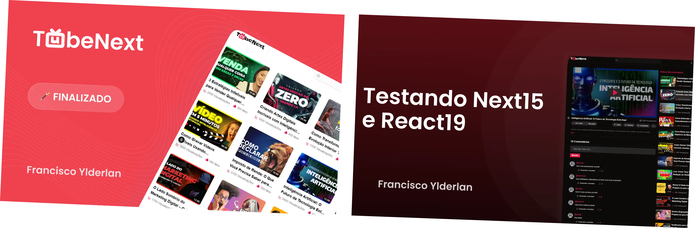

# TubeNext 📺

<p align="center">
  
</p>

  <p align="center">
  
  
  
  
  
</p>

**Descrição:**

O **TubeNext** é uma plataforma de repositório de vídeos, inspirada no YouTube, desenvolvida com tecnologias modernas para fornecer uma interface para pesquisa e visualização de vídeos, assim como vídeos relacionados.
Este projeto visa explorar as novas funcionalidades do **Next.js 15** e **React 19**, com foco em otimização de performance e implementação das mais recentes melhorias, como o **Turbopack estável**, o novo sistema de **cache**, as **APIs de requisição assíncronas**, o **componente de Form** e o suporte ao **TypeScript** no **next.config**.

## Funcionalidades

- **Busca de vídeos**: Permite realizar a pesquisa de vídeos em uma interface de pesquisa simples e intuitiva.
- **Listagem de vídeos relacionados**: Após a busca, exibe vídeos sugeridos que estão relacionados ao conteúdo pesquisado.

## Como rodar o projeto

Para rodar o projeto localmente, siga as etapas abaixo:

1. Clone o repositório:

   ```bash
   git clone https://github.com/seu-usuario/tube-next.git
   cd tube-next
   ```

2. Instale as dependências:

   ```bash
    pnpm install
   ```

3. Execute o servidor de desenvolvimento:

   ```bash
     pnpm dev
   ```

4. Acesse o projeto no navegador:

   ```bash
     http://localhost:3000
   ```
